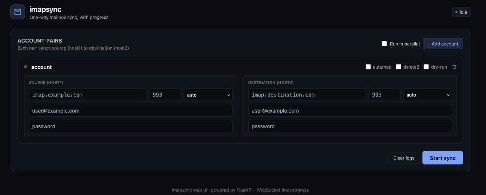

# imapsync web UI

A modern web interface for [imapsync](https://imapsync.lamiral.info/) with
live progress bars, multi-account support, and a single self-contained
Docker image.



## Features

- **Multi-account input** - add N source → destination pairs in one go,
  sync serially or in parallel.
- **Live progress bars** - per-account progress streamed over WebSocket,
  parsed from imapsync stdout (folder name, message count, byte totals,
  errors).
- **Modern UI** - dark theme, Tailwind via CDN, zero build step.
- **Secure credentials** - passwords written to short-lived `passfile*`
  files (chmod 600) and removed immediately after the run, never passed
  on the command line.
- **Self-contained Docker image** - all Perl deps + imapsync + Python
  backend + frontend in one container, ~400 MB.

## Quick start

```bash
docker compose up --build
# open http://localhost:8000
```

## Architecture

```
+-------------------+   WebSocket   +---------------------+
|  Browser (UI)     | <-----------> |  FastAPI app.py     |
|  Tailwind + JS    |   JSON events |  uvicorn            |
+-------------------+               +----------+----------+
                                                   | asyncio.create_subprocess_exec
                                                   v
                                       +-----------+-----------+
                                       |  imapsync (perl)     |
                                       |  per-account run     |
                                       +-----------------------+
```

- **Backend**: Python 3.12 + FastAPI + uvicorn. Runs each imapsync
  invocation as a subprocess, parses stdout line-by-line, fans out events
  to subscribed WebSocket clients.
- **Frontend**: single HTML + vanilla JS module. Tailwind via CDN keeps
  the build step away.
- **Multi-account**: each run holds a list of `Account` objects; the
  driver runs them serially by default, or concurrently via
  `asyncio.gather` when "Run in parallel" is checked.

## Image contents

| Component     | Source                                |
|---------------|---------------------------------------|
| imapsync      | `imapsync` (vendored at build time)   |
| Perl runtime  | Debian `bookworm-slim` + CPAN packages|
| Python 3.12   | `python:3.12-slim-bookworm` base      |
| Web server    | FastAPI + uvicorn                     |
| Frontend      | `frontend/` (static)                  |

## UI options exposed per account

| Field      | Maps to imapsync flag |
|------------|------------------------|
| host/port  | `--host1`/`--port1`, `--host2`/`--port2` |
| user/pass  | `--user1`/`--user2`, `--passfile1`/`--passfile2` |
| encryption | `--ssl1`/`--tls1`, `--ssl2`/`--tls2` |
| automap    | `--automap` |
| delete2    | `--delete2` |
| dry-run    | `--dry` |

Anything else from `imapsync --help` can be appended by editing
`SyncOptions.extra` (default off in UI for safety).

## Endpoints

| Method | Path                              | Purpose                          |
|--------|-----------------------------------|----------------------------------|
| GET    | `/`                               | Web UI                           |
| GET    | `/api/health`                     | healthcheck                      |
| POST   | `/api/sync`                       | start a multi-account run        |
| GET    | `/api/sync/{id}`                  | run status snapshot              |
| POST   | `/api/sync/{id}/abort`            | abort a running sync             |
| GET    | `/api/runs`                       | list all runs in memory          |
| WS     | `/ws/{id}`                        | live event stream for a run      |

## Local dev (no docker)

```bash
# 1. install imapsync on host (or use the system package)
# 2. backend
python -m venv .venv && source .venv/bin/activate
pip install -r backend/requirements.txt
IMAPSYNC_LOG_DIR=$(pwd)/logs uvicorn app:app --reload --app-dir backend

# 3. open http://localhost:8000
```

## Logs

imapsync writes per-account log files to `IMAPSYNC_LOG_DIR` (default
`/var/log/imapsync-ui` inside the container). Mount a volume to persist.

## Security notes

- Passwords are passed via `--passfile*` to avoid exposing them via `ps`.
- Files are mode 0600 and removed at run end (success or failure).
- The container drops privileges to a non-root user before starting
  uvicorn.
- No TLS termination in the container - put it behind a reverse proxy
  (Traefik, Caddy, nginx) for HTTPS in production.

## License

NOLIMIT (NLPL), same as imapsync itself.